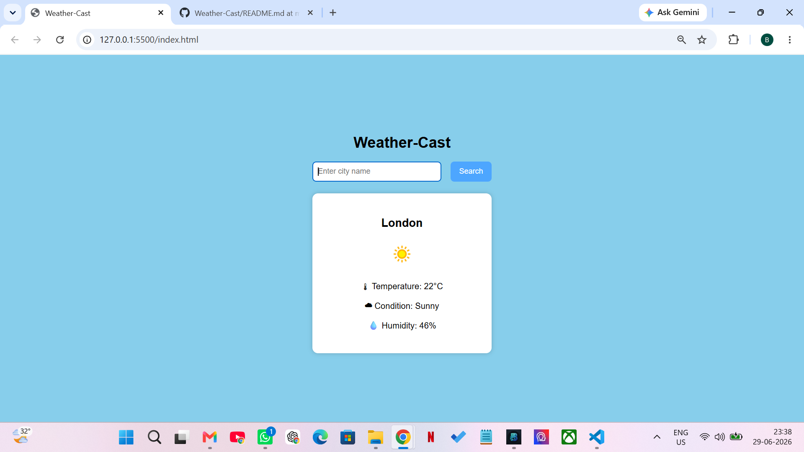
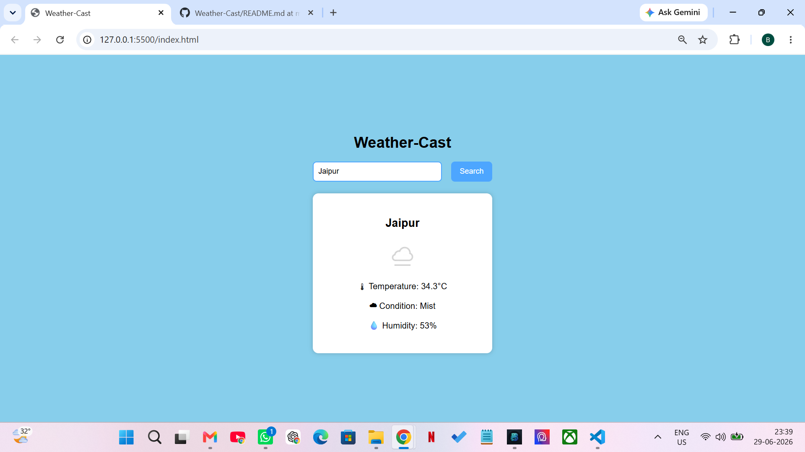
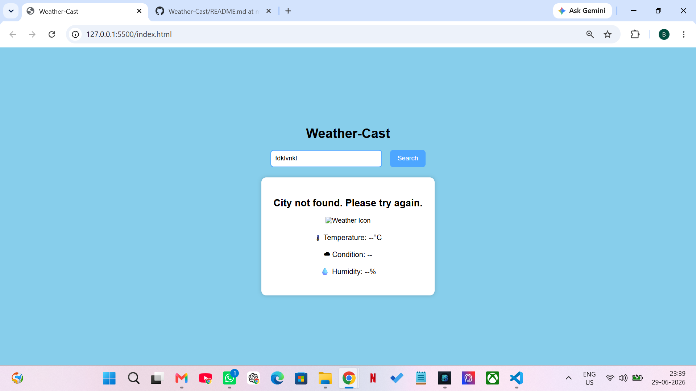

# Weather-Cast
Weather application using JavaScript and WeatherAPI.
A simple weather application built using HTML, CSS, and JavaScript. It fetches real-time weather data from the WeatherAPI using the Fetch API and displays the current temperature, weather condition, humidity, and weather icon for the searched city.
## Features ##
 1. Search weather by city name
 2. Live weather data using WeatherAPI
 3. Displays temperature, condition, humidity, and weather icon
 4. Error handling for invalid city names using try...catch

## Live Website Link ##
https://weather-cast-peach.vercel.app/
## Screenshots

